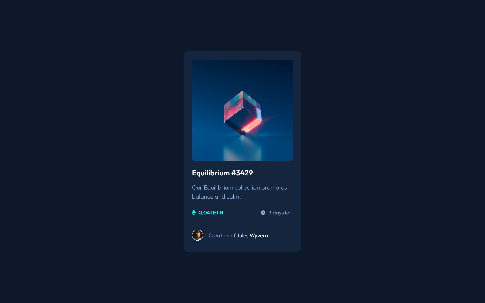
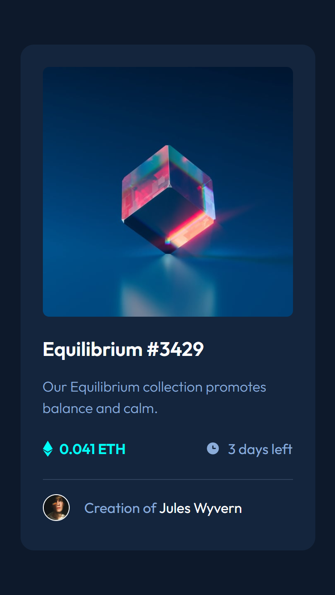

# Frontend Mentor - NFT Preview Card Solution

This is a solution to the [NFT preview card component challenge on Frontend Mentor](https://www.frontendmentor.io/challenges/nft-preview-card-component-SbdUL_w0U).

## Links

- Solution URL:
- Live site URL: [NFT preview card component live site](https://kom42ec.github.io/nft-preview-card/)

## Screenshots

### Desktop 1440px

### Mobile 375px

## Built with

- Semantic HTML5 markup
- CSS custom properties
- Flexbox
- Desktop-first workflow

## Author

- Frontend Mentor - [Nikola Komazec](https://www.frontendmentor.io/profile/kom42ec)
- Twitter - [@kom42ec](https://twitter.com/kom42ec)
